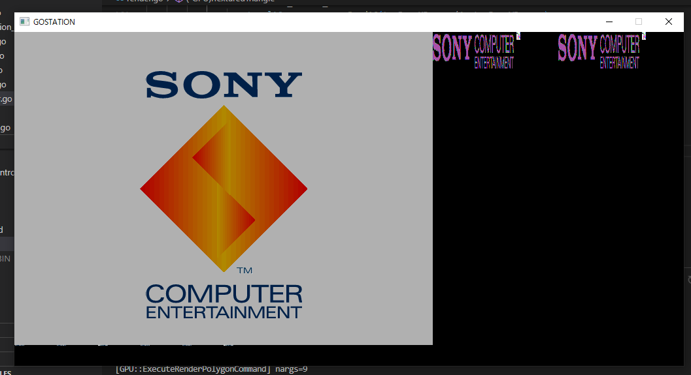

# GoStation

WIP PSX emulator in Go

TODO:
- Figure out how to load game rom
  * also find how out to get out of a infinite loop after boot logo get displayed
- CDROM
- timers
- timing
- better DMA behaviour
- controller input
- interrupt handling
- instruction caching
- start implementing GTE
- more GPU commands and other obscure GPU stuff
- optimize software renderer
  * improve performance of triangle rendering algorithm?
  * use fixed point arithmetic
  * run renderer in a different thread?
  * many other things
- boot Crash Bandicoot
- TTY debug output
- web server for debugging
- wasm port
- savestates
