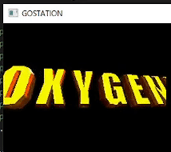

WIP PSX emulator in Go

TODO:

- timers
- controllers and maybe memcards?
- more interrupts like dma interrupts
- more gpu stuff like dithering and texture masking
- line rendering commands
- gpu command mirrors
- make hello.exe and hello2.exe work (fix double buffering and vsync issues)
- more cdrom commands
- gte
- icache, dcache, and texture cache
- pass amidog's psx_cpu test
- using [this](https://github.com/JaCzekanski/ps1-tests/blob/master/cpu/access-time/psx.log) as reference, implement bus waitstates
- threaded software renderer
- implement scanline-based triangle rasterizer?
- add more stuff to cdrom to boot crash bandicoot
- web server for debugging
- wasm port
- savestates
